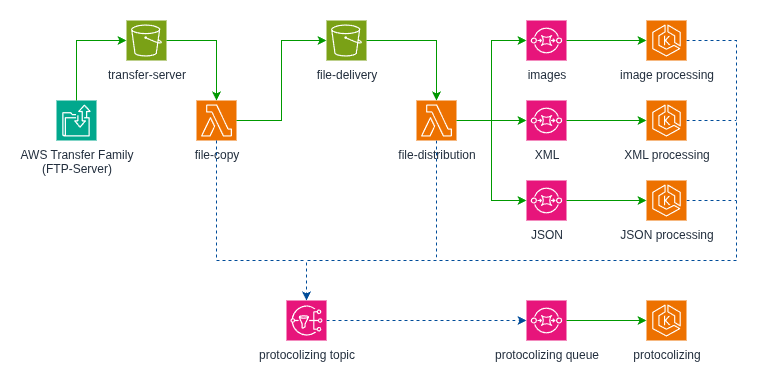

# Docker compose Example

This directory contains an examples for the use of the AwsMock AWS simulation package running as a docker container.
The infrastructure is auto-loaded from the provided ```init/init.json``` file. It consists of a FTP server, some S3
buckets, an SNS topic, SQS queues, a lambda function and an application server.

## Start AwsMock as a docker container

Start awsmock as a docker container using:

```
cd dist/samples/docker
docker-compose up -d
```

This will start the docker container as well as a mongodb instance. The configuration will be taken from
```./etc/awsmock.json```. If you need to customize the behavior of AwsMock, make the necessary changes in this
configuration file.

In the provided configuration file, the 'autoload' features is enabled. This means that the infrastructure will be
loaded automatically from the ```./init``` directory, when the docker container is started. Therefore, the
infrastructure is already available when the docker container is started. To change the configuration, you can
either change the ```./init/init.json``` file or remove the ```init``` directory.

## Provided infrastructure

The example AwsMock init file contains the following infrastructure:



It consists of an FTP server, which copies the incoming files to a S3 bucket (transfer-server), a lambda function
(file-copy), which transfers the file to a local S3 bucket (file-delivery). A second lambda function processes the
file according to its content and sends a notification message to different SQS queues, according to the content mime
type. The SQS queues are used to trigger the application server (image-processing, XML processing and JSON processing).
All of the processes are sending log messages to the protocolizing SNS topic. This SNS topic has a fanout queue, which
is used to send the log messages to the change-log application. The change-log application is a simple web application
that displays the log messages to stdout.

All applications and lambdas are written in Java using the AWS Java SDK. Each SQS queue has a corresponding
dead-letter-queue

## Load the lambda function

During startup the lambda function will be created, but the necessary function code will not be loaded into the docker
daemon. To load the lambda function, open a browser window and go to ```http://localhost:4567``` and change to the
lambda module.


Click on the ```Upload function code``` button and select the ```file-copy-lambda.zip``` file, located in the lambda
directory. Do the same for the ```file-delivery-lambda.zip```.

## Load the applications

During startup the applications will be created, but the necessary Java code will not be loaded into the docker daemon.
To load the application code, open a browser window, go to ```http://localhost:4567``` and change to the application
module.


Click on the ```Upload function code``` button and select the ```file-copy-lambda.zip``` file, located in the lambda
directory. Do the same for the ```file-delivery-lambda.zip```.
